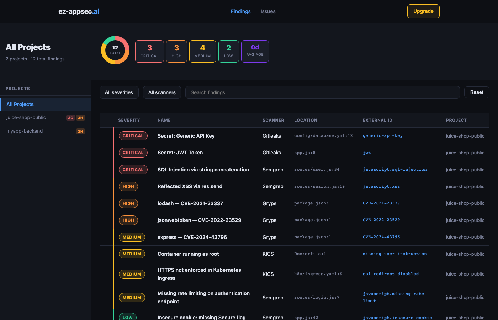
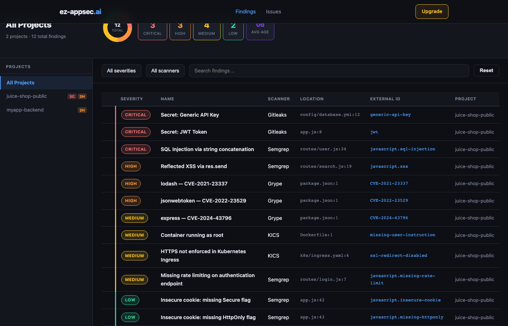
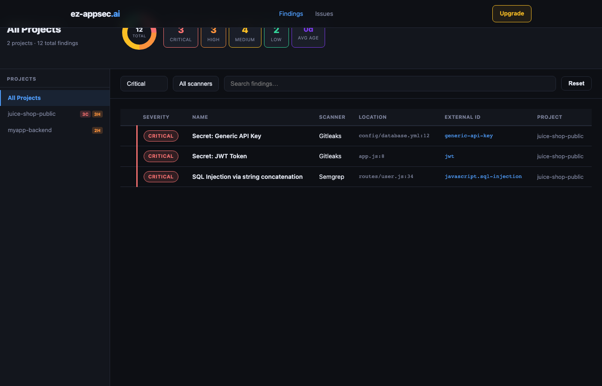
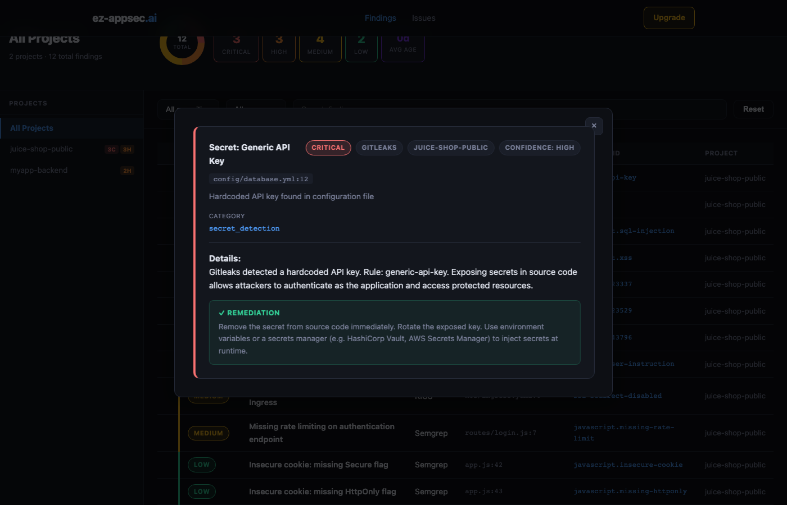
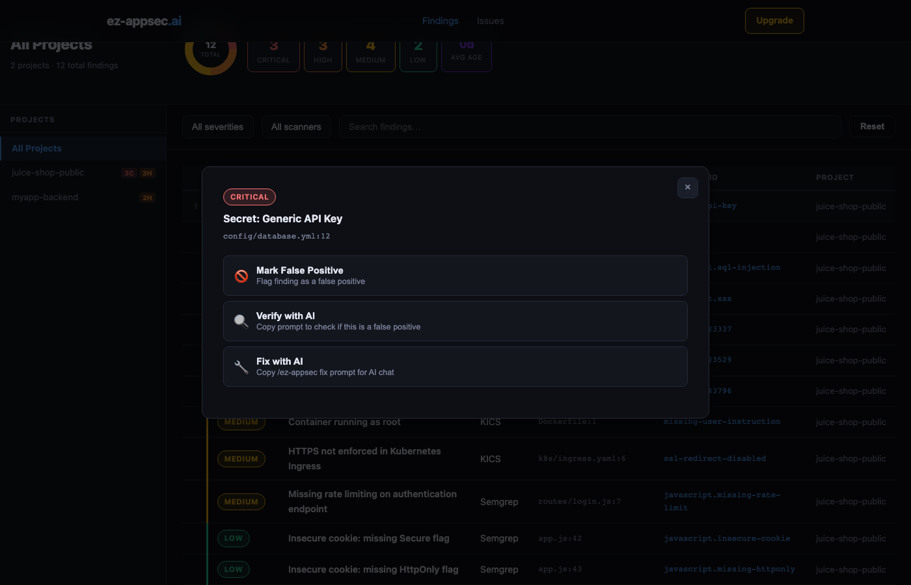
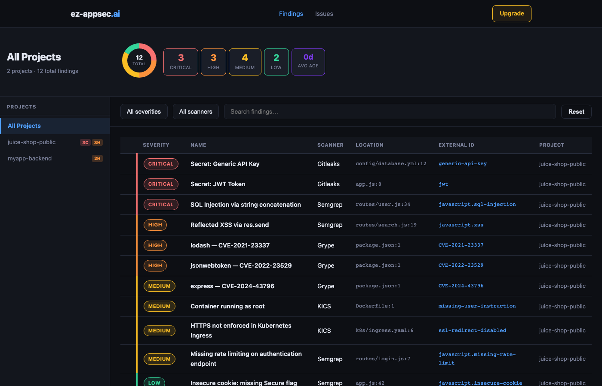
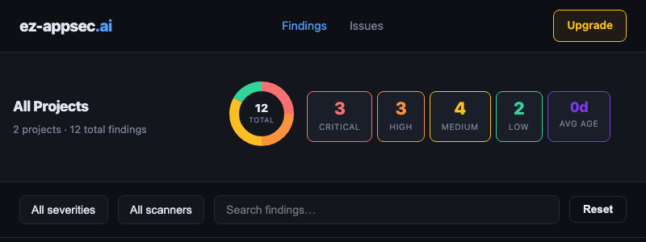

# ez-appsec

**AI-powered application security scanning** — A free, open-source AI first security suite that works with GitLab and GitHub.

## Overview

`ez-appsec` leverages artificial intelligence to analyze your codebase for security vulnerabilities, then provides AI-powered remediation guidance. It combines multiple detection mechanisms with OpenAI's language models to deliver fast, accurate, and actionable security insights.

### Key Features

- **🚀 External Scanner Integration**: Leverages gitleaks, semgrep, kics, and grype
- **🤖 AI-Powered Remediation**: LLM-based guidance for fixing security issues
- **🎯 Multi-Language Support**: Supports all languages covered by external scanners
- **📊 Multiple Output Formats**: JSON, SARIF (GitHub/GitLab compatible), **GitLab Vulnerability Format**
- **⚡ Zero Configuration**: Works out of the box with external tools
- **🆓 Free & Open Source**: No cloud dependency, run locally

## How It Works

ez-appsec is a thin orchestration layer that runs best-in-class open-source scanners, normalises their output into a single schema, optionally enriches findings with AI guidance, and pushes results to a hosted security dashboard.

```
┌─────────────────────────────────────────────────────────────────┐
│                        Your codebase                            │
└───────────────────────────┬─────────────────────────────────────┘
                            │  ez-appsec scan / github-scan / gitlab-scan
                            ▼
┌─────────────────────────────────────────────────────────────────┐
│                    Scanner orchestration                         │
│                                                                 │
│   gitleaks      semgrep        kics           grype             │
│  (secrets)      (SAST)       (IaC)        (dependencies)        │
└───────────────────────────┬─────────────────────────────────────┘
                            │  raw JSON from each tool
                            ▼
┌─────────────────────────────────────────────────────────────────┐
│                   Normalization layer                            │
│  Unified schema: type · severity · file · line · scanner · CVE  │
└───────────────────────────┬─────────────────────────────────────┘
                            │
              ┌─────────────┼─────────────┐
              │  (optional) │             │
              ▼             ▼             ▼
        AI enrichment   Filter by    Sort by severity
        (OpenAI API)    severity
              │
              ▼
┌─────────────────────────────────────────────────────────────────┐
│                       Output formats                             │
│                                                                 │
│  CLI summary   JSON   SARIF (GitHub)   GitLab vuln format        │
└───────────────────────────┬─────────────────────────────────────┘
                            │  push via CI/CD
                            ▼
┌─────────────────────────────────────────────────────────────────┐
│               Security Dashboard (GitHub / GitLab Pages)         │
│  Multi-project · severity filters · finding detail · AI fix      │
└─────────────────────────────────────────────────────────────────┘
```

### Scan pipeline

| Step | What happens |
|------|-------------|
| **1. Run scanners** | ez-appsec invokes each installed scanner (gitleaks, semgrep, kics, grype) against the target path and captures their raw JSON output |
| **2. Normalise** | Each scanner's output is converted to a unified vulnerability schema with consistent severity levels, file paths, and line numbers |
| **3. AI enrich** | When `OPENAI_API_KEY` is set, each finding gets an AI-generated risk explanation and step-by-step fix — this step is optional and skipped otherwise |
| **4. Filter & sort** | Findings are filtered by the requested severity floor and sorted critical → high → medium → low |
| **5. Report** | Results are written as CLI output, JSON, SARIF (for GitHub Security tab), or GitLab vulnerability format |
| **6. Dashboard push** | In CI/CD mode, `vulnerabilities.json` is committed to the dashboard repo; the Pages site rebuilds automatically |

---

## Installation

### From Source

```bash
git clone https://github.com/ez-appsec/ez-appsec.git
cd ez-appsec
pip install -e .
```

### Docker

Pre-built image with all scanners included (published to GitHub Container Registry):

```bash
# Pull from GHCR
docker pull ghcr.io/ez-appsec/ez-appsec:latest

# Or build locally
docker build -t ez-appsec:latest .

# Run scan
docker run --rm -v $(pwd):/scan ghcr.io/ez-appsec/ez-appsec:latest scan .
```

Lightweight variant (~300MB):
```bash
docker pull ghcr.io/ez-appsec/ez-appsec:slim
docker run --rm -v $(pwd):/scan ghcr.io/ez-appsec/ez-appsec:slim scan .
```

### From PyPI (Coming Soon)

```bash
pip install ez-appsec
```

### Requirements

- Python 3.9+
- OpenAI API key (for AI-powered analysis, optional)

## Quick Start

### Install Claude Code Skill

Add the `/ez-appsec-install` and `/ez-appsec-scan` slash commands to your project:

```bash
curl -fsSL https://raw.githubusercontent.com/ez-appsec/ez-appsec/main/skills/install.sh | bash -s -- --project
```

Then use `/ez-appsec-install` to add ez-appsec scanning to any GitLab project via a `scan.yml` include and merge request.

For GitHub projects, use `/ez-appsec-install-github` to add GitHub Actions workflow integration:

```bash
curl -fsSL https://raw.githubusercontent.com/ez-appsec/ez-appsec/main/skills/install.sh | bash -s --github
```

This will:
- Add `.github/workflows/github-scan.yml` to your repository
- Set up version control variables
- Configure GitHub Pages dashboard integration (optional)
- Create a pull request for review

### Check Scanner Installation

```bash
# See which scanners are installed
ez-appsec status

# Install recommended scanners (macOS)
brew install gitleaks semgrep kics grype
```

### Basic Security Scan

```bash
# Scan current directory
ez-appsec scan

# Scan specific path
ez-appsec scan /path/to/project

# Save results to JSON
ez-appsec scan . --output results.json
```

### GitLab Vulnerability Format

Generate reports compatible with GitLab's security dashboard:

```bash
# Scan and output in GitLab vulnerability format
ez-appsec gitlab-scan . --output gitlab-report.json

# With AI analysis and custom prompt
ez-appsec gitlab-scan . --ai-prompt "Focus on critical issues" --output report.json
```

The GitLab format includes:
- Standardized vulnerability schema
- Severity levels (critical, high, medium, low, info)
- Location information (file, line numbers)
- Remediation suggestions
- Scanner identification
- CVE references where available

### GitHub SARIF Format

Generate reports compatible with GitHub Advanced Security:

```bash
# Scan and output in SARIF format
ez-appsec github-scan . --output ez-appsec.sarif

# With AI analysis and custom prompt
ez-appsec github-scan . --ai-prompt "Focus on critical issues" --output report.sarif
```

The SARIF format includes:
- Standardized SARIF 2.1.0 schema
- Severity levels mapped to SARIF levels (error, warning, note)
- Location information (file, line numbers, regions)
- Rule definitions with help URIs
- Scanner identification
- CVE references where available

**Note**: To view SARIF results in GitHub Security tab, use the GitHub Actions workflow which includes SARIF upload. GitHub Advanced Security license is required for Security tab display.

### Initialize Configuration

```bash
# Create default .ez-appsec.yaml
ez-appsec init
```

### Quick Check (No AI)

```bash
# Fast secrets detection without AI analysis
ez-appsec check
```

### With AI Analysis

```bash
# Enable AI remediation guidance (requires OPENAI_API_KEY)
export OPENAI_API_KEY=sk-...
ez-appsec scan . --ai-prompt "Focus on SQL injection and authentication issues"
```

## Configuration

Create a `.ez-appsec.yaml` file in your project root:

```yaml
# Programming languages to scan
languages:
  - python
  - javascript
  - go
  - java

# Minimum severity to report (critical, high, medium, low, all)
severity: medium

# AI model configuration
ai:
  model: gpt-4
  temperature: 0.5

# Custom detection rules
custom_rules: []

# Exclude patterns
exclude:
  - .git
  - node_modules
  - __pycache__
  - .venv
```

## Detection Mechanisms

ez-appsec relies entirely on industry-leading open-source security scanners:

### External Scanners (Primary)

- **[gitleaks](https://github.com/gitleaks/gitleaks)** - Secrets detection with 140+ patterns
- **[semgrep](https://semgrep.dev/)** - SAST with 1000+ rules across languages
- **[kics](https://www.kics.io/)** - Infrastructure as code security scanning
- **[grype](https://github.com/anchore/grype)** - Vulnerability and SBOM analysis

### AI Enhancement

All findings from external scanners are enhanced with AI-powered analysis when OPENAI_API_KEY is provided, offering:
- Detailed risk explanations
- Step-by-step remediation guidance
- Code examples for fixes

### AI-Powered Analysis

When OPENAI_API_KEY is set, each finding receives:
- Detailed risk explanation
- Step-by-step remediation guidance
- Code examples for fixes

## Example Output

```
✓ Security scan completed
  Total issues found: 5

Top Issues:
  [critical] Potential hardcoded secrets
    Found suspicious pattern in config.py
  [high] Potential SQL injection
    Found suspicious pattern in database.py
  [medium] Potential unsafe eval
    Found suspicious pattern in utils.py
```

## Integration with CI/CD

### GitHub Actions

Add ez-appsec scanning to any GitHub repository by creating `.github/workflows/ez-appsec-scan.yml`:

```yaml
name: ez-appsec Security Scan
on:
  pull_request:
  push:
    branches: [main]
  workflow_dispatch:

permissions:
  contents: read
  security-events: write
  pull-requests: write

jobs:
  scan:
    runs-on: ubuntu-latest
    container:
      image: ghcr.io/ez-appsec/ez-appsec:latest
      options: --entrypoint ""
    steps:
      - uses: actions/checkout@v4
      - name: Run ez-appsec scan
        run: ez-appsec github-scan . --output scan-results/ez-appsec.sarif
      - name: Upload SARIF to GitHub Security
        if: always()
        uses: github/codeql-action/upload-sarif@v3
        with:
          sarif_file: scan-results/ez-appsec.sarif
        continue-on-error: true
```

See [`.github/workflows/github-scan.yml`](.github/workflows/github-scan.yml) for the full workflow with PR comments and dashboard integration.

### Docker Compose

```yaml
services:
  security-scan:
    image: ghcr.io/ez-appsec/ez-appsec:latest
    volumes:
      - .:/scan
    environment:
      - OPENAI_API_KEY=${OPENAI_API_KEY}
    command: scan . --output results.json
```

### GitHub Pages Dashboard

See the [Dashboard](#dashboard) section below for full feature documentation and screenshots.

```bash
# Fork the dashboard template into your org or user account
gh repo fork ez-appsec/ez-appsec-dashboard --org YOUR_ORG --clone

# Enable GitHub Pages (serves from /public on main branch)
gh api --method PUT repos/YOUR_ORG/ez-appsec-dashboard/pages \
  -f '{"source":{"branch":"main","path":"/public"}}'
```

Each scanned repo sends results to the dashboard via `DASHBOARD_PUSH_TOKEN` (a PAT with `repo` scope set as a repository secret).

## API Usage

### Basic Scanning

```python
from ez_appsec.scanner import SecurityScanner
from ez_appsec.config import Config

config = Config(severity="medium", ai_model="gpt-4")
scanner = SecurityScanner(config)

results = scanner.scan("/path/to/code")
print(f"Found {results['total']} issues")
```

### GitLab Vulnerability Format

```python
from ez_appsec.scanner import SecurityScanner
from ez_appsec.config import Config

config = Config(severity="high")
scanner = SecurityScanner(config)

# Generate GitLab-compatible vulnerability report
gitlab_report = scanner.scan_to_gitlab_format("/path/to/code", "report.json")
print(f"Generated report with {len(gitlab_report['vulnerabilities'])} vulnerabilities")
```

### GitHub SARIF Format

Generate reports compatible with GitHub Advanced Security:

```python
from ez_appsec.scanner import SecurityScanner
from ez_appsec.config import Config

config = Config(severity="high")
scanner = SecurityScanner(config)

# Generate SARIF report
github_report = scanner.scan_to_github_format("/path/to/code", "report.json")
print(f"Generated SARIF report with {len(github_report['runs'][0]['results'])} findings")
```

The SARIF format is compatible with GitHub's security features and can be uploaded via the GitHub Actions workflow.

### Individual Scanner Output Conversion

```python
from ez_appsec.converters import VulnerabilityConverters

# Convert gitleaks output to GitLab format
report = VulnerabilityConverters.convert_scanner_output(
    "gitleaks", "gitleaks-output.json", "gitlab-report.json"
)

# Supported scanners: gitleaks, semgrep, kics, grype
```

## Dashboard

The ez-appsec security dashboard is a static web application hosted on GitHub Pages (or GitLab Pages). It aggregates vulnerability scan results from one or more repositories into a single view with filtering, drill-down, and AI-powered remediation guidance.

### Setup

```bash
# 1. Fork the dashboard repo into your GitHub org
gh repo fork ez-appsec/ez-appsec-dashboard --org YOUR_ORG --clone

# 2. Enable GitHub Pages
gh api --method PUT repos/YOUR_ORG/ez-appsec-dashboard/pages \
  -f '{"source":{"branch":"main","path":"/public"}}'

# 3. Add DASHBOARD_PUSH_TOKEN secret to each repo you want to scan
#    (a PAT with repo scope)
gh secret set DASHBOARD_PUSH_TOKEN --repo YOUR_ORG/YOUR_REPO
```

For GitLab, run `/ez-appsec-install-dashboard <group-path>` in Claude Code to create and configure the dashboard project automatically.

---

### Overview — Vulnerability summary

The dashboard header shows the total vulnerability counts broken down by severity, an average finding age metric, and a visual severity distribution chart. A **Run Scan** button links directly to the latest CI/CD workflow run.

<!-- TODO: add screenshot -->


---

### Multi-project sidebar

When scan results from more than one repository have been pushed, a project sidebar appears on the left. Click any project to filter the main view to that repo's findings only, or select **All Projects** to see the aggregate.

<!-- TODO: add screenshot -->


---

### Vulnerability list

Findings are displayed as cards sorted by severity (critical first). Each card shows:
- Severity badge (color-coded)
- Finding title and scanner source (gitleaks, semgrep, kics, grype)
- Affected file and line number
- Short description

The list is paginated (100 per page) and updates live as filters change.

<!-- TODO: add screenshot -->


---

### Filters

Three filter controls narrow the vulnerability list without a page reload:

| Filter | Options |
|--------|---------|
| **Severity** | All · Critical · High · Medium · Low · Info |
| **Scanner** | All · Gitleaks · Semgrep · Grype · KICS |
| **Search** | Free-text search across title, description, file path |

<!-- TODO: add screenshot -->


---

### Finding detail

Click any vulnerability card to open a detail modal with the full finding:
- Rule ID and scanner name
- Severity level
- Affected file path and line number
- Full description
- CVE reference (where available)
- Links to the source commit

<!-- TODO: add screenshot -->


---

### AI remediation guidance

Each finding includes an **AI Fix** button that opens a remediation panel with:
- Plain-language explanation of the risk
- Step-by-step fix instructions
- Code example (where applicable)

Requires `OPENAI_API_KEY` to be set in the scanning environment.

<!-- TODO: add screenshot -->


---

### GitHub Security tab (SARIF)

When the `github-scan` workflow runs, findings are uploaded to the GitHub Security tab via SARIF. This requires no additional configuration — the workflow handles the upload automatically.

<!-- TODO: add screenshot -->


---

### PR comment

On pull requests, the workflow posts a summary comment with the finding count and a link to the full run artifacts.

<!-- TODO: add screenshot -->


---

## Contributing

Contributions are welcome! Areas for improvement:

- [ ] Additional language support (Rust, C/C++, C#)
- [ ] Custom rule definitions
- [ ] Integration with more AI providers
- [ ] Performance optimization for large codebases
- [ ] Machine learning model for false positive reduction

## Roadmap

- **v0.2.0**: Support for Rust and C/C++
- **v0.3.0**: Custom rule engine and policy enforcement
- **v0.4.0**: Integration with Claude, Gemini, and local LLMs
- **v1.0.0**: Production-ready release

## License

MIT License - See LICENSE file for details

## Support

- 📖 [Documentation](./docs)
- 🐛 [Issue Tracker](https://github.com/ez-appsec/ez-appsec/issues)
- 💬 [Discussions](https://github.com/ez-appsec/ez-appsec/discussions)
- 🔒 [Security Policy](./SECURITY.md)

## Author

Created by [John Felten](https://www.linkedin.com/in/john-felten/) - DevSecOps Engineer with 25+ years of experience

## Disclaimer

While ez-appsec aims to be comprehensive, no security tool catches all vulnerabilities. Always conduct thorough security reviews and penetration testing before deploying to production.
